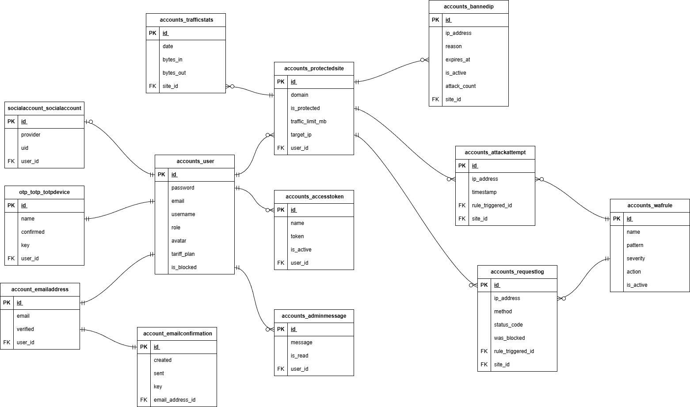
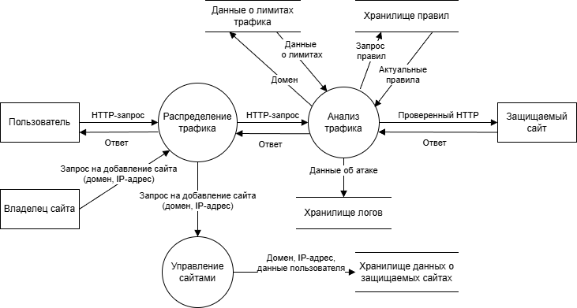

# Описание системы
## Структура ПО
Перечень программных компонентов, обеспечивающих работу WAF в режиме Reverse Proxy:
    1. Nginx v1.29.2.3.
    2. Веб-сервер управления, написанный на языке Python и фреймворке Django
    3. Сервер фильтрации трафика, написанный на языке Python и фреймворке Django.
    4. СУБД хранения данных PostgreSQL v15.

## Структурная схема ПО в нотации C4
### Уровень контекста
Данная диаграмма отображает место WAF в общей инфраструктуре и его взаимодействие с внешними сущностями. Система выступает в роли защитного барьера между внешним миром (пользователями и потенциальными злоумышленниками) и целевым веб-приложением.

### Уровень контейнеров
Диаграмма детализирует внутренний состав системы, разделяя её на функциональные блоки, развернутые в изолированных Docker-контейнерах:
    1. Nginx: Точка входа, распределяющая трафик.
    2. Engine: Аналитический модуль на Python, реализующий сигнатурный и эвристический анализ трафика.
    3. Web: Панель управления для владельцев сайтов и администраторов.
    4. Database (PostgreSQL): Реляционное хранилище для учетных записей, настроек проксирования, сигнатур и логов атак.

## Схемы баз данных (ERD) 
ER-диаграмма описывает структуру хранения данных. Архитектура БД построена вокруг двух ключевых сущностей:
    1. User (Пользователь): Хранит данные владельцев аккаунтов, их токены доступа и настройки 2FA.
    2. ProtectedSite (Защищаемый сайт): Центральная таблица, связывающая пользователей с параметрами проксирования (домены, IP-адреса) и результатами работы фильтра (логи атак, статистика трафика).

## Функциональная схема ПО
Диаграмма потоков данных иллюстрирует логику обработки информации внутри ПО.
    1. Обработка трафика: HTTP-запрос поступает от клиента, проходит через процесс анализа, где проверяется с помощью базы сигнатур, и трансформируется либо в "чистый" запрос к приложению, либо в запись об инциденте в базе логов.
    2. Добавление нового сайта: конфигурационные данные от владельца сайта через веб-интерфейс обновляют состояние хранилищ.

